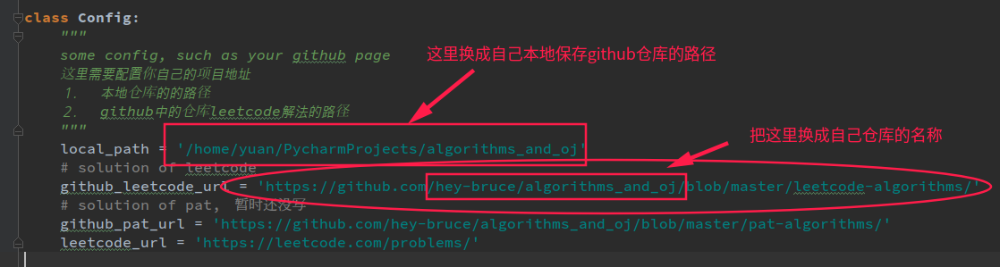
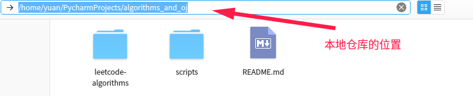
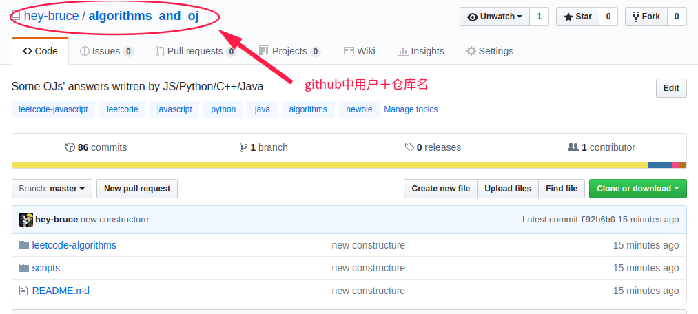

## 脚本使用方法
首先，需要安装`requests`这个库，如果没有安装，请使用下面这个命令
```
pip install requests
```
然后，打开该文件，在`Config`类中配置自己的路径，有两个地方需要配置。
`local_path` 和 `github_leetcode_url`，如下图：



- local_path`是你本地保存github仓库中的路径,如图：

  


- `github_leetcode_url`是你github上解题结果的路径,如图：
  


然后只需要在对应目录下面使用下面命令运行该脚本就好了
```
python readme.py
```

首次创建就运行上面的脚本。

更新就把对应题目的解答放到相对于文件夹下面，然后运行该脚本。
